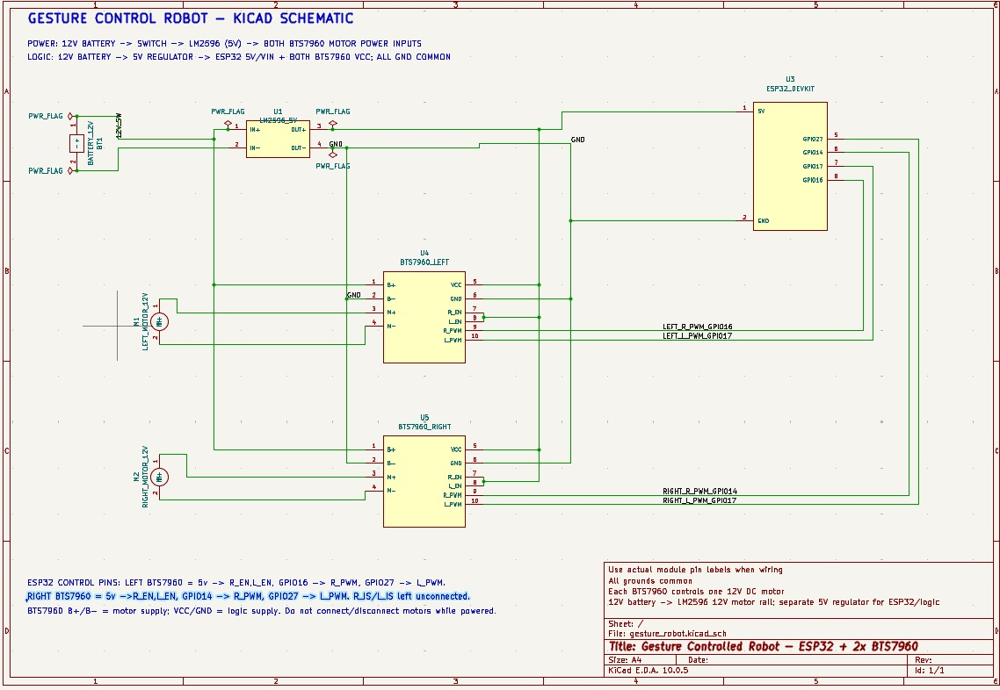

# Real-Time Gesture Controlled Robot

[](https://colab.research.google.com/drive/1Y-Jy4CHJZim0w5HRuw7QdaRUHD0IRaVc?usp=sharing)
[](https://www.python.org/)
[](https://pytorch.org/)
[](https://github.com/ultralytics/ultralytics)
[](https://www.espressif.com/)
[](https://www.kicad.org/)
[](LICENSE)

An end-to-end, low-latency vision-controlled robotic platform. This project integrates custom-trained **YOLOv8** hand-gesture recognition with an **ESP32** microcontroller and dual **BTS7960 43A H-Bridge** motor drivers via a high-throughput **asynchronous WebSocket** protocol.

Both dedicated **CPU** (`main.cpu.py`) and **CUDA GPU** (`main.cuda.py`) runtimes are supported, complemented by an interactive dual-motor serial calibration utility, custom model training pipeline on Google Colab, and complete KiCad electrical schematics.

---

## System Architecture

```
┌─────────────────┐       ┌───────────────────────────┐       ┌────────────────────────┐
│  HD USB Camera  │ ───>  │  OpenCV Frame Processing  │ ───>  │   YOLOv8 Deep Model    │
│  (30 / 60 FPS)  │       │ (Mirror Flip, 320x320 px) │       │ (CPU or CUDA Pipeline) │
└─────────────────┘       └───────────────────────────┘       └───────────┬────────────┘
                                                                          │ Detected Gesture
                                                                          ▼
┌─────────────────┐       ┌───────────────────────────┐       ┌────────────────────────┐
│ Dual High-Power │       │     ESP32 NodeMCU-32S     │       │ Non-Blocking Async     │
│ BTS7960 Drivers │ <───  │ Hardware LEDC PWM (5 kHz) │ <───  │ WebSocket Sender Queue │
│ (Left & Right)  │       │  Watchdog Timer (1000 ms) │ (WiFi)│ (maxsize=1, no lag)    │
└────────┬────────┘       └───────────────────────────┘       └────────────────────────┘
         │
         ▼
┌─────────────────┐
│ 2x 12V High-    │
│ Torque Motors   │
└─────────────────┘
```

### Engineering Highlights

1. **Zero-Latency Network Pipeline**: 
   The camera ingestion and YOLO inference loops are completely decoupled from network operations. Commands are dispatched through a single-slot daemon worker queue (`queue.Queue(maxsize=1)`), dropping outdated frames during network jitter to ensure the robot responds only to the freshest command.
2. **Dynamic Heartbeat & Watchdog Safety**:
   - Python client sends continuous state packets every `200 ms` to maintain link integrity.
   - The ESP32 firmware features an active hardware watchdog (`SIGNAL_TIMEOUT = 1000 ms`). If the computer crashes, disconnects, or WiFi drops for over 1 second, all PWM outputs immediately zero out, preventing runaway collisions.
3. **Dual Runtime Optimization**:
   - `main.cpu.py`: Explicit PyTorch intra-op thread allocation (`torch.set_num_threads`), tuned for laptops and single-board computers without discrete GPUs.
   - `main.cuda.py`: Direct GPU tensor inference with explicit CUDA memory cache purging on teardown.
4. **Isolated Dual Power Architecture**:
   Heavy inductive motor loads draw high surge currents. The circuit isolates the 12V high-discharge battery rail from the 5V ESP32 logic rail via an LM2596 step-down buck converter with a common ground plane, eliminating microcontroller brownouts.

---

## Hardware Schematic & Circuit Design

The schematic was designed in **KiCad 10** and validated for high-power DC motor control.



*KiCad source schematic file:* [`gesture_robot.kicad_sch`](./gesture_robot.kicad_sch)

### Bill of Materials (BOM)

| Component | Specification | Function |
| :--- | :--- | :--- |
| **Microcontroller** | ESP32 NodeMCU (30-pin / 38-pin) | Real-time WebSocket server, PWM generation, watchdog |
| **Motor Drivers** | 2x BTS7960 (IBT-2) 43A H-Bridge | Independent high-current forward/reverse motor drive |
| **Drive Motors** | 2x 12V High-Torque Geared DC Motors | Differential drive locomotion |
| **Logic Power** | LM2596 DC-DC Buck Converter | Steps down 12V battery rail to clean 5V logic |
| **Main Battery** | 12V Li-ion / 3S LiPo / Lead-Acid | Power delivery for motors and buck converter |
| **Vision Input** | USB Webcam or Integrated Camera | Captures hand gestures for real-time inference |

### Pinout & Wiring Table

> [!IMPORTANT]
> Both BTS7960 drivers must share a common ground (`GND`) with the ESP32 and the LM2596 buck converter. Keep `VCC` on the logic header of BTS7960 connected to `5V` (not 3.3V) to guarantee proper gate driver saturation.

| ESP32 Pin | Connected Component | Target Pin | Description |
| :--- | :--- | :--- | :--- |
| **GPIO 16** | Left BTS7960 | `L_RPWM` | Left Motor Forward PWM |
| **GPIO 17** | Left BTS7960 | `L_LPWM` | Left Motor Reverse PWM |
| **GPIO 27** | Right BTS7960 | `R_RPWM` | Right Motor Forward PWM |
| **GPIO 14** | Right BTS7960 | `R_LPWM` | Right Motor Reverse PWM |
| **VIN / 5V** | LM2596 Buck Converter | `OUT+ (5V)` | 5V Power supply for ESP32 & Driver Logic |
| **GND** | LM2596 & BTS7960 | `GND / OUT-` | Common System Ground |
| **5V Rail** | Left & Right BTS7960 | `R_EN` & `L_EN` | Bridge Enable Pins (Tied High to 5V) |

---

## Gesture Control Mapping

The custom YOLOv8 model (`best.pt`) was trained to classify five distinct hand postures:

| Gesture | Class Name | Robot Action | Motor Actuation Pattern |
| :---: | :---: | :---: | :--- |
| 👌 | `okay` | **FORWARD** | Left & Right motors drive forward at calibrated baseline PWM |
| 🤟 | `spiderman` | **BACKWARD** | Left & Right motors drive reverse at calibrated baseline PWM |
| 👎 | `dislike` | **LEFT** | Left motor reverse/hold, Right motor forward (pivot turn) |
| 👍 | `like` | **RIGHT** | Left motor forward, Right motor reverse/hold (pivot turn) |
| ✊ | `rock` | **STOP** | All PWM signals zeroed (`0, 0, 0, 0`) |
| *None* | *(No box detected)* | **STOP** | Failsafe timeout stops the vehicle immediately |

---

## Model Training & Evaluation (Google Colab)

The gesture recognition model was trained in the cloud using **Google Colab** with NVIDIA GPU acceleration.

[](https://colab.research.google.com/drive/1Y-Jy4CHJZim0w5HRuw7QdaRUHD0IRaVc?usp=sharing)  
*Full training notebook source:* [`training/train_gesture_yolo.ipynb`](./training/train_gesture_yolo.ipynb) | *Dataset schema:* [`training/data.yaml`](./training/data.yaml)

### Training Configuration

- **Base Architecture**: YOLOv8n (Nano backbone, 3.01M parameters, 8.2 GFLOPs)
- **Hardware Acceleration**: Google Colab NVIDIA Tesla T4 (15 GB VRAM)
- **Training Duration**: 50 Epochs (~1.25 hours) with AdamW optimizer (`lr=0.0011`, `momentum=0.9`)
- **Dataset Composition**: 992 labeled images (993 gesture instances) across two merged datasets with automated label remapping.
- **Data Augmentations**:
  - Rotation: $\pm 15.0^\circ$
  - Horizontal Flip: 50%
  - Vertical Flip: 20%
  - HSV Color Jitter: Hue=0.015, Saturation=0.7, Value=0.4
  - Random Erasing / Cutout: 10%
  - Perspective Transformation: 0.001
  - Mosaic: Active for first 40 epochs (closed for final 10 epochs for fine-grained boundary refinement)

### Validation Performance (`best.pt`)

Evaluated at 640x640 validation resolution across all 5 classes:

| Class | Instances | Precision (P) | Recall (R) | mAP@50 | mAP@50-95 |
| :--- | :---: | :---: | :---: | :---: | :---: |
| **Overall (All Classes)** | **993** | **0.998 (99.8%)** | **0.994 (99.4%)** | **0.993 (99.3%)** | **0.752 (75.2%)** |
| `okay` | 88 | 0.998 | 0.989 | 0.985 | 0.726 |
| `spiderman` | 72 | 1.000 | 0.999 | 0.995 | 0.731 |
| `like` | 278 | 0.995 | 0.993 | 0.995 | 0.773 |
| `dislike` | 275 | 0.996 | 0.994 | 0.995 | 0.770 |
| `rock` | 280 | 1.000 | 0.997 | 0.995 | 0.762 |

*Inference Speed on Tesla T4:* Pre-process `0.2 ms`, Inference `2.7 ms`, Post-process `2.6 ms` per frame.

---

## Firmware Setup (Arduino IDE)

The [`Arduino IDE Codes/`](./Arduino%20IDE%20Codes/) directory contains two sketches:

### 1. Motor Calibration Utility (`calibration.ino`)
DC motors rarely spin at identical speeds due to gearbox tolerances and friction. This sketch provides an interactive **Serial CLI** (115200 baud) over USB to dynamically trim differential motor speeds while the robot is running:

```
Input format: [Target][+/-Value or DirectNumber] + Enter
  L   -> Straight   : Left motor  (e.g., L+5, L-2, L210)
  R   -> Straight   : Right motor (e.g., R+3, R-5, R190)
  TLL -> Turn-Left  : Left motor  (e.g., TLL0, TLL+5)
  TLR -> Turn-Left  : Right motor (e.g., TLR160, TLR+5)
  TRL -> Turn-Right : Left motor  (e.g., TRL165, TRL-3)
  TRR -> Turn-Right : Right motor (e.g., TRR0, TRR+2)
```

Use this tool to find your chassis's straight-line equilibrium before uploading the final production sketch.

### 2. Production Firmware (`main.ino`)
- Flashed once trimming is finalized.
- Connects to your local 2.4 GHz WiFi network.
- Hosts the WebSocket server on port `81`.
- Receives motion commands (`FORWARD`, `BACKWARD`, `LEFT`, `RIGHT`, `STOP`) and handles hardware PWM signals.
- Runs the 1000 ms watchdog failsafe.

#### Flashing Instructions
1. Open [`Arduino IDE Codes/main.ino`](./Arduino%20IDE%20Codes/main.ino) in Arduino IDE.
2. Install the required library via the Library Manager:
   - **WebSockets** by *Markus Sattler*
3. Select your ESP32 board (`Tools -> Board -> ESP32 Arduino -> ESP32 Dev Module`).
4. Update your WiFi credentials:
   ```cpp
   const char* ssid = "YOUR_WIFI_SSID";
   const char* password = "YOUR_WIFI_PASSWORD";
   ```
5. Upload the sketch and open the Serial Monitor at **115200 baud**.
6. Note the assigned IP address printed upon connection (e.g., `10.97.227.48`).

---

## Python Software Setup

### Prerequisites
- Python 3.9, 3.10, or 3.11
- Working webcam
- Network connectivity on the same subnet as the ESP32

### 1. Clone & Environment Setup

```bash
git clone https://github.com/<your-username>/Real-Time-Gesture-Controlled-Robot.git
cd Real-Time-Gesture-Controlled-Robot

# Create a virtual environment
python -m venv venv

# Activate the virtual environment
# Windows (PowerShell):
.\venv\Scripts\Activate.ps1
# Windows (cmd):
.\venv\Scripts\activate.bat
# Linux / macOS:
source venv/bin/activate
```

### 2. Dependency Installation

Choose the configuration that matches your host hardware:

#### Option A: CPU Runtime (Any PC / Laptop)
```bash
pip install -r requirements-cpu.txt
```

#### Option B: CUDA GPU Runtime (NVIDIA GPU with CUDA 12.1+)
```bash
pip install -r requirements-cuda.txt
```

*(Alternatively, run `pip install -r requirements.txt` for standard PyPI dependencies).*

### 3. Configure ESP32 IP Address

Open [`main.cpu.py`](./main.cpu.py) or [`main.cuda.py`](./main.cuda.py) and update `ESP32_IP` with the IP displayed in the Arduino Serial Monitor:

```python
# ESP32 WebSocket Settings
ESP32_IP = "10.97.227.48"  # Replace with your ESP32's current IP
WEBSOCKET_PORT = 81
```

### 4. Running the Controller

**For CPU Inference:**
```bash
python main.cpu.py
```

**For CUDA GPU Inference:**
```bash
python main.cuda.py
```

- Press `q` while focused on the video feed to safely shut down the camera, zero the robot motors, and exit.

---

## Repository Structure

```
.
├── CONTRIBUTING.md           # Contribution guidelines & team engineering roles
├── Arduino IDE Codes/
│   ├── calibration.ino       # Interactive serial CLI for live differential motor trimming
│   └── main.ino              # Production ESP32 firmware (WebSocket server + watchdog)
├── KiCad_Diagram.jpeg        # Full schematic diagram render
├── LICENSE                   # MIT License
├── README.md                 # Complete project documentation
├── best.pt                   # Trained YOLOv8 gesture recognition weights
├── gesture_robot.kicad_sch   # KiCad 10 schematic source file
├── main.cpu.py               # CPU-optimized real-time vision & WebSocket controller
├── main.cuda.py              # CUDA GPU-accelerated vision & WebSocket controller
├── requirements-cpu.txt      # Dependency manifest for CPU installations
├── requirements-cuda.txt     # Dependency manifest for CUDA GPU installations
├── requirements.txt          # Universal dependency manifest
└── training/
    ├── data.yaml             # 5-class YOLOv8 dataset configuration
    └── train_gesture_yolo.ipynb # Complete Google Colab training notebook
```

---

## Performance & Latency Profile

| Metric | CPU Pipeline (`main.cpu.py`) | CUDA GPU Pipeline (`main.cuda.py`) |
| :--- | :--- | :--- |
| **Inference Hardware** | Intel Core i7 / AMD Ryzen (Multi-thread) | NVIDIA RTX 3060 / 4060 or better |
| **Inference Latency** | ~25 - 35 ms | ~5 - 8 ms |
| **Frame Processing Rate** | 25 - 35 FPS | 60+ FPS (Camera bottlenecked) |
| **Network Dispatch Latency**| < 3 ms (Local LAN) | < 3 ms (Local LAN) |
| **End-to-End Latency** | **< 40 ms** | **< 12 ms** |

---

## Troubleshooting & Engineering Notes

### 1. ESP32 Resets When Motors Start (Brownout)
- **Cause**: Motors draw high inrush currents at stall/startup, pulling the supply rail down below the ESP32's internal 2.7V brownout detector threshold.
- **Fix**: Verify that the LM2596 buck converter powers the ESP32 through a separate tap, with a 470 µF–1000 µF electrolytic capacitor placed across the buck converter output. Never power the BTS7960 motor rails directly from the ESP32 5V/VIN pin.

### 2. WebSocket Connection Refused
- Ensure your computer and ESP32 are connected to the **same Wi-Fi router** (and that client isolation / AP isolation is turned off in router settings).
- Verify the IP address printed on the ESP32 Serial Monitor matches the `ESP32_IP` string in the Python script.
- Ensure port `81` is not blocked by local OS firewall policies.

### 3. One Motor Runs in Reverse
- Invert the respective RPWM and LPWM pin assignments in `main.ino` or swap the `M+` and `M-` leads on the BTS7960 terminal block.

### 4. Camera Ingestion Lag
- Keep `IMG_SIZE = 320` in the Python script. Hand posture bounding boxes do not require 640x640 resolutions, and 320x320 cuts tensor compute time by over 60%.

---

## Team & Contributors

Developed as a collaborative engineering robotics project by our core team:

| Contributor | GitHub Profile | Engineering Role |
| :--- | :--- | :--- |
| **Prince Sanchela** | [@PrinceSanchela](https://github.com/PrinceSanchela) | **Core Robotics & CPU Pipeline**: Hardware schematics, ESP32 firmware, CPU vision client (`main.cpu.py`), and system integration |
| **Vedant Chauhan** | [@VedantChauhan14](https://github.com/VedantChauhan14) | **ML & CUDA GPU Pipeline**: Google Colab training, YOLOv8 evaluation, dataset merging, and CUDA vision client (`main.cuda.py`) |
| **Aastha** | [@Aastha150](https://github.com/Aastha150) | **Computer Vision & Annotation**: Gesture image collection, multi-class bounding box labeling |
| **Aahyam Rehman** | [@rehmanaahyam](https://github.com/rehmanaahyam) | **Mechanical Fabrication**: Robot chassis assembly, motor mounting, and locomotion testing |
| **Aakarsh** | [@akarsh-616](https://github.com/akarsh-616) | **Power Systems**: Wiring harness, LM2596 buck regulation, and electrical hardware testing |
| **Het Zaveri** | [@Het-Zaveri](https://github.com/Het-Zaveri) | **Telemetry & QA**: WebSocket latency benchmarking, watchdog safety verification, and QA |

For contribution guidelines, code standards, and PR workflows, please see [**CONTRIBUTING.md**](./CONTRIBUTING.md).

---

## License

This project is licensed under the [MIT License](./LICENSE) - see the LICENSE file for details.
